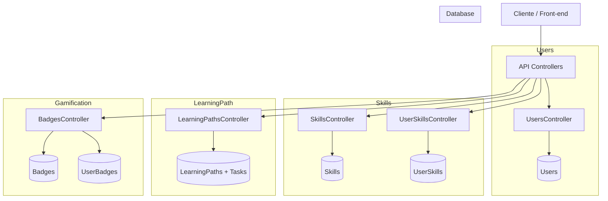

# Reframe – Plataforma Inteligente de Upskilling & Reskilling com IA (ASP.NET Core)

Reframe é uma plataforma desenvolvida para auxiliar profissionais e organizações a se adaptarem às demandas do **Futuro do Trabalho**, oferecendo mapeamento de habilidades, identificação de lacunas, geração automática de trilhas de aprendizagem com IA e gamificação completa.

Este projeto foi desenvolvido como entrega acadêmica para **Web Services / ASP.NET Core – FIAP**, seguindo requisitos de boas práticas, arquitetura limpa, integração com banco de dados, versionamento e documentação completa.

---

## Objetivo do Projeto

O Reframe tem como proposta:

* Mapear habilidades atuais de profissionais.
* Comparar essas habilidades com competências emergentes do mercado.
* Gerar automaticamente trilhas de aprendizagem personalizadas (Learning Paths).
* Aplicar gamificação com badges, XP e metas.
* Apoiar empresas na visualização de mobilidade interna e carreiras emergentes.
* Disponibilizar APIs organizadas, versionadas e documentadas com Swagger.
* Utilizar Entity Framework Core para persistência.

---

##  Arquitetura do Sistema (ASP.NET Core)

A API é construída em **ASP.NET Core 8**, com arquitetura modular seguindo boas práticas da Microsoft.

### Estrutura do Projeto

```
Reframe.Api
 ├── Controllers
 │     ├── V1 (versão estável da API)
 │     └── V2 (versão evoluída)
 ├── Domain
 │     ├── Entities (User, Skill, Badge, LearningPath...)
 │     └── Enums (UserRole)
 ├── Infrastructure
 │     └── ReframeDbContext (Entity Framework Core)
 ├── Program.cs (versionamento, Swagger, DI)
 └── appsettings.json (Connection string SQL Server)
```

###  Módulos Principais

* **User** – Gestão de usuários e perfis.
* **Organization** – Empresas e estruturas organizacionais.
* **Skill** – Skills de mercado (com "MarketDemandScore").
* **UserSkill** – Perfil individual de habilidades.
* **LearningPath** – Trilha gerada automaticamente pela IA.
* **Badge / UserBadge** – Sistema completo de gamificação.

###  Segurança

A versão acadêmica usa autenticação simplificada, mas a arquitetura está preparada para integração JWT.

---

## 🛠 Tecnologias Utilizadas

* **.NET 8 – ASP.NET Core Web API**
* **Entity Framework Core (SQL Server)**
* **Swagger (Swashbuckle)**
* **API Versioning**
* Padrão RESTful com status codes corretos

---

##  Como Rodar o Projeto

### 1. Pré-requisitos

* .NET 8 SDK
* SQL Server Local ou Docker

### 2. Criar o banco de dados

```sql
CREATE DATABASE ReframeDb;
```

### 3. Configurar `appsettings.json`

```
"ConnectionStrings": {
  "DefaultConnection": "Server=localhost;Database=ReframeDb;Trusted_Connection=True;TrustServerCertificate=True"
}
```

### 4. Criar MIGRATIONS e gerar tabelas

```bash
cd src/Reframe.Api
dotnet ef migrations add InitialCreate
dotnet ef database update
```

### 5. Rodar a API

```bash
dotnet run
```

Swagger disponível em:

```
https://localhost:8080/swagger
```

---

##  Versionamento da API

A API utiliza versionamento por URL:

* **v1** → `/api/v1/...`
* **v2** → `/api/v2/...`

### Diferenças principais:

#### v1 (estável)

* CRUD completo de Users, Skills, LearningPaths, Badges
* IA básica para gerar trilhas

#### v2 (evolução)

* Learning Path inclui campos extras (ex.: EstimatedHours)
* Pensada para expansão futura

---

##  Endpoints Principais

###  Usuários

| Método | Endpoint             | Descrição        |
| ------ | -------------------- | ---------------- |
| GET    | `/api/v1/users`      | Lista usuários   |
| POST   | `/api/v1/users`      | Cria usuário     |
| GET    | `/api/v1/users/{id}` | Busca por ID     |
| PUT    | `/api/v1/users/{id}` | Atualiza usuário |
| DELETE | `/api/v1/users/{id}` | Remove usuário   |

---

###  Skills & Perfil do Usuário

| Método | Endpoint                                 |
| ------ | ---------------------------------------- |
| POST   | `/api/v1/skills`                         |
| GET    | `/api/v1/skills`                         |
| POST   | `/api/v1/userskills`                     |
| GET    | `/api/v1/userskills/user/{id}`           |

---

###  Learning Path (IA)

| Método | Endpoint                                  | Descrição              |
| ------ | ----------------------------------------- | ---------------------- |
| POST   | `/api/v1/learningpaths/generate/{userId}` | Gera trilha automática |
| GET    | `/api/v1/learningpaths/user/{userId}`     | Lista trilhas          |
| GET    | `/api/v2/learningpaths/user/{userId}`     | Versão avançada        |

---

###  Gamificação

| Método | Endpoint                                             |
| ------ | ---------------------------------------------------- |
| POST   | `/api/v1/badges`                                     |
| GET    | `/api/v1/badges/{id}`                                |
| POST   | `/api/v1/badges/award/user/{userId}/badge/{badgeId}` |
| GET    | `/api/v1/badges/user/{userId}`                       |

---

##  IA Reframe Engine

A engine analisa:

* Gap entre **CurrentLevel** e **TargetLevel**
* Demanda de mercado (**MarketDemandScore**)

E gera uma trilha de aprendizado dinâmica:

* Tarefas ordenadas por prioridade
* Cursos, projetos e recomendações automáticas

---

## 🕹 Gamificação

* Badges
* XP
* Metas por trilha
* Histórico de conquistas

Criado para incentivar **upskilling contínuo**.

---

## 🖥 Diagrama da Arquitetura (Mermaid)



---

##  Integrantes do Grupo

* **Julio Cesar Zampieri – RM 98772**
* **João Gabriel Dias de Mello do Nascimento – RM 99092**
* **Ricardo Augusto de Matos Filho – RM 95906**

---

##  Contato

Dúvidas ou sugestões? Entre em contato em: **[contact.zampieri@gmail.com](mailto:contact.zampieri@gmail.com)**

---

> *"Upskill, Reskill & Reframe your Future."*

